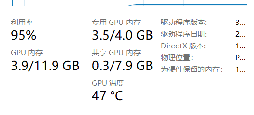

- [官方文档](https://doc.fedml.ai/index.html)
- [repo](https://github.com/FedML-AI/FedML)

# 克隆fedml库
```sh
git clone https://github.com/FedML-AI/FedML.git
```
- 参阅源码
- 参考样例，测试环境
  - FedML/iot/anomaly_detection_for_cybersecurity FedML/python/setup.py

# wsl - cuda
- [参考](https://blog.csdn.net/woshiheweigui/article/details/109067091)

## 安装支持wsl的Nvidia驱动
- [下载地址](https://developer.nvidia.com/cuda/wsl)

## 下载安装cuda
- 不要下载最新版11.7，pytorch目前不支持
```bash
sudo apt update
sudo apt install build-essential #安装c++ make等环境
wget https://developer.download.nvidia.com/compute/cuda/11.6.2/local_installers/cuda_11.6.2_510.47.03_linux.run
sudo bash cuda_11.6.2_510.47.03_linux.run
```

## 环境变量
- 在目录`~/.bashrc`下 追加
```bash
export CUDA_HOME=/usr/local/cuda
export PATH=$PATH:$CUDA_HOME/bin
export LD_LIBRARY_PATH=/usr/local/cuda-11.7/lib64${LD_LIBRARY_PATH:+:${LD_LIBRARY_PATH}}
```
- 生效，并安装需要的库
```sh
source ~/.bashrc
sudo apt-get install freeglut3-dev build-essential libx11-dev libxmu-dev libxi-dev libgl1-mesa-glx libglu1-mesa
libglu1-mesa-dev
```
- 检查是否成功
```sh
nvcc -V
```
```sh
nvcc: NVIDIA (R) Cuda compiler driver
Copyright (c) 2005-2022 NVIDIA Corporation
Built on Tue_May__3_18:49:52_PDT_2022
Cuda compilation tools, release 11.7, V11.7.64
Build cuda_11.7.r11.7/compiler.31294372_0
```

# 安装 cudnn
## 下载安装
- [参考](https://docs.nvidia.com/deeplearning/cudnn/install-guide/index.html)
```sh
sudo apt-get install zlib1g
https://developer.nvidia.com/rdp/cudnn-download
tar -xvf cudnn-linux-x86_64-8.4.1.50_cuda11.6-archive.tar.xz
sudo cp cudnn-*-archive/include/cudnn*.h /usr/local/cuda/include
sudo cp -P cudnn-*-archive/lib/libcudnn* /usr/local/cuda/lib64
sudo chmod a+r /usr/local/cuda/include/cudnn*.h /usr/local/cuda/lib64/libcudnn*
```

- 后来发现这种方式使用cnn时会报错，找不到cudnn cnn的动态链接库，改用以下方法
```sh
conda install -c nvidia cudnn
```

<table cellpadding="4" cellspacing="0" summary="" id="cudnn-cuda-hardware-versions__table_u25_cyj_cjb" class="table"
   frame="border" border="1" rules="all">
   <caption><span class="tablecap">Table 1. Supported NVIDIA Hardware and CUDA Version</span></caption>
   <thead class="thead" align="left">
      <tr class="row">
         <th class="entry" valign="top" width="20%" id="d54e101" rowspan="1" colspan="1">cuDNN Package</th>
         <th class="entry" valign="top" width="20%" id="d54e104" rowspan="1" colspan="1">Supported NVIDIA Hardware</th>
         <th class="entry" valign="top" width="20%" id="d54e107" rowspan="1" colspan="1"><a class="xref"
               href="https://developer.nvidia.com/cuda-toolkit-archive" target="_blank" shape="rect">CUDA Toolkit
               Version</a></th>
         <th class="entry" valign="top" width="20%" id="d54e111" rowspan="1" colspan="1"><a class="xref"
               href="https://developer.nvidia.com/cuda-gpus" target="_blank" shape="rect">CUDA Compute Capability</a>
         </th>
         <th class="entry" valign="top" width="20%" id="d54e115" rowspan="1" colspan="1">Supports static linking?<a
               name="fnsrc_1" href="#fntarg_1" shape="rect"><sup>1</sup></a></th>
      </tr>
   </thead>
   <tbody class="tbody">
      <tr class="row">
         <td class="entry" rowspan="8" valign="top" width="20%" headers="d54e101" colspan="1">cuDNN 8.4.1 for CUDA
            11.x<a name="fnsrc_2" href="#fntarg_2" shape="rect"><sup>2</sup></a></td>
         <td class="entry" rowspan="8" valign="top" width="20%" headers="d54e104" colspan="1"><a
               name="cudnn-cuda-hardware-versions__ul_s5d_42l_cnb" shape="rect">
               <!-- -->
            </a>
            <ul class="ul" id="cudnn-cuda-hardware-versions__ul_s5d_42l_cnb">
               <li class="li">NVIDIA Ampere Architecture</li>
               <li class="li">NVIDIA Turing™</li>
               <li class="li">NVIDIA Volta™</li>
               <li class="li">NVIDIA Pascal™</li>
               <li class="li">NVIDIA Maxwell<sup>®</sup></li>
               <li class="li">NVIDIA Kepler™</li>
            </ul>
         </td>
         <td class="entry" valign="top" width="20%" headers="d54e107" rowspan="1" colspan="1"><a class="xref"
               href="https://developer.nvidia.com/cuda-toolkit-archive" target="_blank" shape="rect"><u
                  class="ph u">11.7</u></a></td>
         <td class="entry" rowspan="8" valign="top" width="20%" headers="d54e111" colspan="1">SM 3.5 and later</td>
         <td class="entry" rowspan="5" valign="top" width="20%" headers="d54e115" colspan="1">Yes</td>
      </tr>
      <tr class="row">
         <td class="entry" valign="top" width="20%" headers="d54e107" rowspan="1" colspan="1"><a class="xref"
               href="https://developer.nvidia.com/cuda-toolkit-archive" target="_blank" shape="rect"><u
                  class="ph u">11.6</u></a></td>
      </tr>
      <tr class="row">
         <td class="entry" valign="top" width="20%" headers="d54e107" rowspan="1" colspan="1"><a class="xref"
               href="https://developer.nvidia.com/cuda-toolkit-archive" target="_blank" shape="rect"><u
                  class="ph u">11.5</u></a></td>
      </tr>
      <tr class="row">
         <td class="entry" valign="top" width="20%" headers="d54e107" rowspan="1" colspan="1"><a class="xref"
               href="https://developer.nvidia.com/cuda-toolkit-archive" target="_blank" shape="rect"><u
                  class="ph u">11.4</u></a></td>
      </tr>
      <tr class="row">
         <td class="entry" valign="top" width="20%" headers="d54e107" rowspan="1" colspan="1"><a class="xref"
               href="https://developer.nvidia.com/cuda-toolkit-archive" target="_blank" shape="rect"><u
                  class="ph u">11.3</u></a></td>
      </tr>
      <tr class="row">
         <td class="entry" valign="top" width="20%" headers="d54e107" rowspan="1" colspan="1">
            <p class="p"><a class="xref" href="https://developer.nvidia.com/cuda-toolkit-archive" target="_blank"
                  shape="rect"><u class="ph u">11.2</u></a></p>
         </td>
         <td class="entry" rowspan="3" valign="top" width="20%" headers="d54e115" colspan="1">No</td>
      </tr>
      <tr class="row">
         <td class="entry" valign="top" width="20%" headers="d54e107" rowspan="1" colspan="1"><a class="xref"
               href="https://developer.nvidia.com/cuda-toolkit-archive" target="_blank" shape="rect"><u
                  class="ph u">11.1</u></a></td>
      </tr>
      <tr class="row">
         <td class="entry" valign="top" width="20%" headers="d54e107" rowspan="1" colspan="1"><a class="xref"
               href="https://developer.nvidia.com/cuda-toolkit-archive" target="_blank" shape="rect"><u
                  class="ph u">11.0</u></a></td>
      </tr>
      <tr class="row">
         <td class="entry" valign="top" width="20%" headers="d54e101" rowspan="1" colspan="1">cuDNN 8.4.1 for CUDA 10.2
         </td>
         <td class="entry" valign="top" width="20%" headers="d54e104" rowspan="1" colspan="1"><a
               name="cudnn-cuda-hardware-versions__ul_bxm_m4v_wlb" shape="rect">
               <!-- -->
            </a>
            <ul class="ul" id="cudnn-cuda-hardware-versions__ul_bxm_m4v_wlb">
               <li class="li">NVIDIA Turing</li>
               <li class="li">NVIDIA Volta</li>
               <li class="li">Xavier™</li>
               <li class="li">NVIDIA Pascal</li>
               <li class="li">NVIDIA Maxwell</li>
               <li class="li">NVIDIA Kepler</li>
            </ul>
         </td>
         <td class="entry" valign="top" width="20%" headers="d54e107" rowspan="1" colspan="1"><a class="xref"
               href="https://developer.nvidia.com/cuda-toolkit-archive" target="_blank" shape="rect"><u
                  class="ph u">10.2</u></a></td>
         <td class="entry" valign="top" width="20%" headers="d54e111" rowspan="1" colspan="1">SM 3.0 and later</td>
         <td class="entry" valign="top" width="20%" headers="d54e115" rowspan="1" colspan="1">Yes</td>
      </tr>
   </tbody>
</table>

# 安装配置fedml
- [参考-（bilibili视频的方法已经过时）](https://doc.fedml.ai/starter/installation.html)
## 安装Miniconda
```sh
wget https://repo.anaconda.com/miniconda/Miniconda3-latest-Linux-x86_64.sh
./Miniconda3-latest-Linux-x86_64.sh
# 最后一步选yes，让脚本自动配置环境变量
# 根据输出的内容决定下面source的文件
source /root/.bashrc
```

## 添加Miniconda源
```sh
conda config --add channels https://mirrors.tuna.tsinghua.edu.cn/anaconda/pkgs/free/
conda config --add channels https://mirrors.tuna.tsinghua.edu.cn/anaconda/pkgs/main/
conda config --add channels https://mirrors.tuna.tsinghua.edu.cn/anaconda/cloud/pytorch/
conda config --add channels https://mirrors.tuna.tsinghua.edu.cn/anaconda/cloud/conda-forge
conda config --add channels https://mirrors.tuna.tsinghua.edu.cn/anaconda/cloud/msys2/
conda config --set show_channel_urls yes #设置搜索时显示通道地址
```

## 安装fedml
```sh
conda create --name fedml python=3.7
conda activate fedml
conda install --name fedml pip
pip install fedml -i https://pypi.douban.com/simple
```

## 备忘
```sh
常用pip源：
豆瓣：https://pypi.douban.com/simple
阿里：https://mirrors.aliyun.com/pypi/simple
中国科技大学 ：https://pypi.mirrors.ustc.edu.cn/simple/
清华大学： https://pypi.tuna.tsinghua.edu.cn/simple/
中国科学技术大学 ：https://pypi.mirrors.ustc.edu.cn/simple/
```

- python包：wasabi-控制台打印和格式化工具包


## 安装fedml环境
- 进入FEDML仓库，[FedML/python](FedML/python/setup.py)，运行setup.py
- [pytorch安装地址](https://pytorch.org/get-started/locally/)，根据cuda版本选择命令，去掉 -c forge（不从官网下载）
```bash
python3 setup.py install
```
- 卸载pytorch，重新按照cuda版本进行安装

```bash
conda uninstall *torch* cudatoolkit
conda install pytorch torchvision torchaudio cudatoolkit=11.6
```


# 运行demo
## iot
- 运行[iot物联网demo](FedML/iot/anomaly_detection_for_cybersecurity/)

### server
```sh
conda activate fedml
bash run_server.sh
```
### client-1
```sh
conda activate fedml
bash run_client.sh 1
```
### client-2
```sh
conda activate fedml
bash run_client.sh 2
```

- 后来发现这个demo适用于树莓派、Jeston Nano设备，需要进行一定的配置
- 这个样例中有自定义data loader和trainer，比较有参考价值


## mpi_torch_fedopt_mnist_lr_example
- 配置文件中，以simulation模式运行的
- [位置](FedML/python/examples/simulation/mpi_torch_fedopt_mnist_lr_example)，以simulation模式运行，单进程

```bash
bash run_step_by_step_example.sh 2
```
- 参数为2时可以完成训练，参数（即worker）过大，会出现以下提示，怀疑是内存不够
```bash
===================================================================================
=   BAD TERMINATION OF ONE OF YOUR APPLICATION PROCESSES
=   PID 5218 RUNNING AT tt
=   EXIT CODE: 9
=   CLEANING UP REMAINING PROCESSES
=   YOU CAN IGNORE THE BELOW CLEANUP MESSAGES
===================================================================================
YOUR APPLICATION TERMINATED WITH THE EXIT STRING: Killed (signal 9)
This typically refers to a problem with your application.
Please see the FAQ page for debugging suggestions
```
- 训练完成后会在目录`./tmp/`下生成一个模型文件`fedml`，执行cat
```bash
cat fedml
```
输出为
```bash
training is finished!
<fedml.arguments.Arguments object at 0x7ff03c13b210>
```

# 使用GPU进行训练

## 修改配置文件
- 修改`config/fedml_config.yaml`文件`device_args`标签下的内容
```yaml
device_args:
  worker_num: 3
  using_gpu: true
  gpu_mapping_file: config/gpu_mapping.yaml #mapping文件位置
  gpu_mapping_key: mapping_tt #使用的mapping
```
## 修改mapping文件
- 在文件`config/gpu_mapping.yaml`下增加节点`mapping_tt`

```yaml
mapping_tt:
    tt: [4] #只有一个节点tt，一个gpu
```
- 增加节点的格式如下，为每个hostname指定在每个gpu下有多少进程
```yaml
# config_cluster0:
#     host_name_node0: [num_of_processes_on_GPU0, num_of_processes_on_GPU1, num_of_processes_on_GPU2, num_of_processes_on_GPU3, ..., num_of_processes_on_GPU_n]
#     host_name_node1: [num_of_processes_on_GPU0, num_of_processes_on_GPU1, num_of_processes_on_GPU2, num_of_processes_on_GPU3, ..., num_of_processes_on_GPU_n]
#     ......
#     host_name_node_m: [num_of_processes_on_GPU0, num_of_processes_on_GPU1, num_of_processes_on_GPU2, num_of_processes_on_GPU3, ..., num_of_processes_on_GPU_n]
```
- 运行，前面配置了4个进程，`worker_num`配置为3，这里参数就写3， 3个worker + 1个server
```bash
bash run_step_by_step_example.sh 3
```
- 过程中在bash中看到输出
```bash
[FedML-Server(0) @device-id-0] [Thu, 28 Jul 2022 20:54:06] [INFO] [gpu_mapping_mpi.py:51:mapping_processes_to_gpu_device_from_yaml_file_mpi] process_id = 2, GPU device = cuda:0
[FedML-Server(0) @device-id-0] [Thu, 28 Jul 2022 20:54:06] [INFO] [device.py:78:get_device] device = cuda:0
```

- taskmgr中查看独显占用情况

- 说明确实使用了gpu

# cross_silo 运行
- 非单进程模拟，多个设备运行
## config/fedml_config.yaml
- 配置节点comm_args
```sh
comm_args:
  backend: "GRPC"
  grpc_ipconfig_path: config/grpc_ipconfig.csv
```
## grpc_ipconfig.csv
- 安装`pip install grpcio`，使用grpc协议进行通信
- 在`/config`下创建该文件，写入`编号-ip`，`0`为server，`1...n`为worker

|receiver_id|ip|
|-|-|
|0|127.0.0.1|
|1|127.0.0.1|
|2|127.0.0.1|

## 结果
- 没有找到输出的模型文件，只在最后一轮结束后找到了以下输出
```bash
[FedML-Server(0) @device-id-0] [Fri, 29 Jul 2022 22:54:08] [INFO] [fedml_aggregator.py:195:test_on_server_for_all_clients] ################test_on_server_for_all_clients : 49
[FedML-Server(0) @device-id-0] [Fri, 29 Jul 2022 22:54:12] [INFO] [fedml_aggregator.py:225:test_on_server_for_all_clients] {'training_acc': 0.796526336274001, 'training_loss': 1.8660167525693983}
[FedML-Server(0) @device-id-0] [Fri, 29 Jul 2022 22:54:13] [INFO] [fedml_aggregator.py:257:test_on_server_for_all_clients] {'test_acc': 0.8005698005698005, 'test_loss': 1.8635211240936371}
```

# fedml自定义
## fedml运行参数
- fedml运行时需要几个参数

|参数|含义|可选值|
|-|-|-|
|--cf|配置文件|/|
|--rank|序号，server为0|0,1,2,3|
|--role|server 或 client|server, client|
## fedml运行流程
```python
args = fedml.init()

# init device
device = fedml.device.get_device(args)

# load data
dataset, output_dim = fedml.data.load(args)

# load model
model = fedml.model.create(args, output_dim)

# start training
fedml_runner = FedMLRunner(args, device, dataset, model)
fedml_runner.run()
```
- DataLoader, Model, Trainer都是可以自定义的
- [参考](./FedML/python/app/fedgraphnn/README.md)

## DataLoader的自定义
- 支持MNN，pytorch的DataLoader
- 输出数据集和输出的维数
## 模型的自定义
- 支持pytorch的神经网络模型，`torch.nn`
## Trainer的自定义
```python
from fedml.core import ClientTrainer

class MyModelTrainer(ClientTrainer): #继承ClientTrainer
    def get_model_params(self):
        return self.model.cpu().state_dict()

    def set_model_params(self, model_parameters):
        self.model.load_state_dict(model_parameters)

    def train(self, train_data, device, args): #实现模型的训练
        pass

    def test(self, test_data, device, args):
        pass

    def test_on_the_server(
        self, train_data_local_dict, test_data_local_dict, device, args=None
    ) -> bool: #实现对模型的评估

        return True
```


# 用qemu虚拟机模拟多台机器（未完成）
## 安装
- 参考[连接](https://www.qemu.org/download/)
### Ninja的安装
```sh
sudo apt install ninja-build
```
### pkg-config
```sh

```
```sh
wget https://download.qemu.org/qemu-7.1.0-rc0.tar.xz
tar xvJf qemu-7.1.0-rc0.tar.xz
cd qemu-7.1.0-rc0
./configure
make
```
- 使用虚拟机环境，需要对qemu配置显卡直通